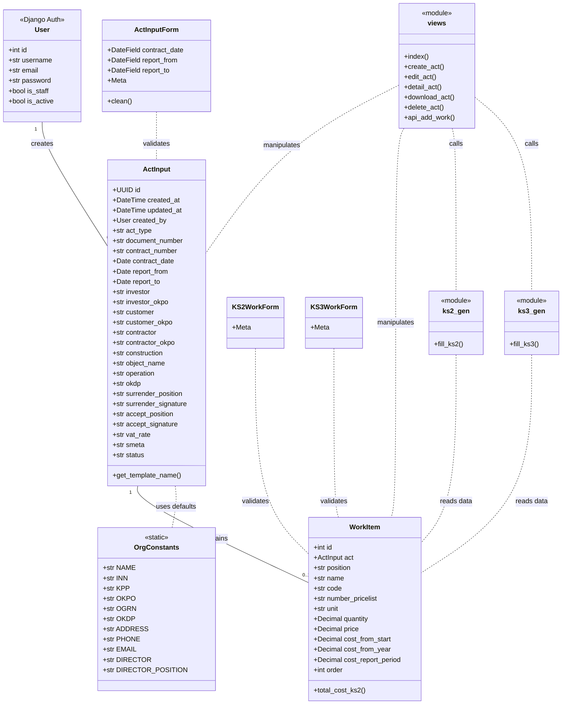
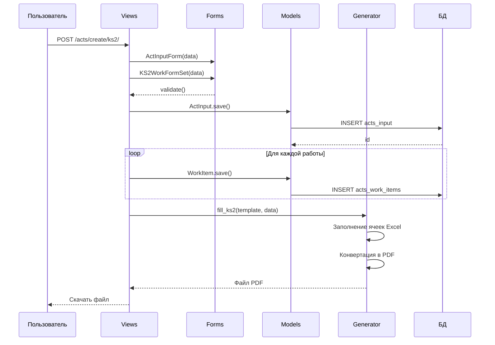

# 2. ПРОЕКТНАЯ ЧАСТЬ

## 2.1. Проектирование системы

### 2.1.1. Создание UML-моделей

Для проектирования информационной системы автоматизации формирования актов КС-2 и КС-3 была разработана UML-модель, включающая диаграмму классов и диаграмму прецедентов.

**Диаграмма классов системы**

Диаграмма классов отражает структуру системы и взаимосвязи между основными компонентами (рисунок 2.1).



*Рисунок 2.1 – Диаграмма классов системы*

**Диаграмма прецедентов**

Диаграмма прецедентов демонстрирует функциональные требования к системе и взаимодействие пользователей с системой (рисунок 2.2).

```mermaid
usecaseDiagram
    actor "Пользователь (Менеджер)" as User
    
    package "Система формирования актов" {
        usecase "Просмотр списка актов" as UC1
        usecase "Создание акта КС-2" as UC2
        usecase "Создание акта КС-3" as UC3
        usecase "Редактирование акта" as UC4
        usecase "Удаление акта (черновик)" as UC5
        usecase "Просмотр деталей акта" as UC6
        usecase "Скачивание в PDF" as UC7
        usecase "Скачивание в XLSX" as UC8
        usecase "Добавление видов работ" as UC9
        usecase "Аутентификация" as UC10
    }
    
    User --> UC10
    User --> UC1
    User --> UC2
    User --> UC3
    User --> UC4
    User --> UC5
    User --> UC6
    User --> UC7
    User --> UC8
    User --> UC9
    
    UC2 .. UC9 : includes
    UC3 .. UC9 : includes
    UC2 .. UC7 : extends
    UC2 .. UC8 : extends
    UC3 .. UC7 : extends
    UC3 .. UC8 : extends
    UC4 .. UC7 : extends
    UC4 .. UC8 : extends

```

*Рисунок 2.2 – Диаграмма прецедентов системы*

**Диаграмма последовательности создания акта**

Диаграмма последовательности иллюстрирует процесс взаимодействия компонентов при создании нового акта (рисунок 2.3).



*Рисунок 2.3 – Диаграмма последовательности создания акта*

### 2.1.2. ER-диаграмма базы данных

База данных системы спроектирована с использованием реляционной модели. Основные сущности и их связи представлены на ER-диаграмме (рисунок 2.4).

```mermaid
erDiagram
    AUTH_USER ||--o{ ACTS_INPUT : creates
    ACTS_INPUT ||--|{ ACTS_WORK_ITEMS : contains
    
    AUTH_USER {
        int id PK
        varchar username
        varchar email
        varchar password
        boolean is_staff
        boolean is_active
        datetime date_joined
    }
    
    ACTS_INPUT {
        uuid id PK
        datetime created_at
        datetime updated_at
        int created_by FK
        varchar act_type
        varchar document_number
        varchar contract_number
        date contract_date
        date report_from
        date report_to
        varchar investor
        varchar investor_okpo
        varchar customer
        varchar customer_okpo
        varchar contractor
        varchar contractor_okpo
        varchar construction
        varchar object_name
        varchar operation
        varchar okdp
        varchar surrender_position
        varchar surrender_signature
        varchar accept_position
        varchar accept_signature
        varchar vat_rate
        varchar smeta
        varchar status
    }
    
    ACTS_WORK_ITEMS {
        bigint id PK
        uuid act_id FK
        varchar position
        text name
        varchar code
        varchar number_pricelist
        varchar unit
        decimal quantity
        decimal price
        decimal cost_from_start
        decimal cost_from_year
        decimal cost_report_period
        int order
    }

```



*Рисунок 2.4 – ER-диаграмма базы данных*

**Описание таблиц базы данных**

Таблица 2.1 – Описание таблицы `auth_user` (стандартная таблица Django)

| Поле | Тип | Описание |
|------|-----|----------|
| id | INTEGER | Первичный ключ |
| username | VARCHAR(150) | Имя пользователя |
| email | VARCHAR(254) | Электронная почта |
| password | VARCHAR(128) | Хэш пароля |
| is_staff | BOOLEAN | Статус персонала |
| is_active | BOOLEAN | Активность учётной записи |
| date_joined | DATETIME | Дата регистрации |

Таблица 2.2 – Описание таблицы `acts_input`

| Поле | Тип | Описание |
|------|-----|----------|
| id | UUID | Первичный ключ (уникальный идентификатор) |
| created_at | DATETIME | Дата и время создания записи |
| updated_at | DATETIME | Дата и время последнего обновления |
| created_by | INTEGER (FK) | Ссылка на пользователя-создателя |
| act_type | VARCHAR(3) | Тип акта (ks2/ks3) |
| document_number | VARCHAR(50) | Номер документа |
| contract_number | VARCHAR(50) | Номер договора подряда |
| contract_date | DATE | Дата заключения договора |
| report_from | DATE | Начало отчётного периода |
| report_to | DATE | Окончание отчётного периода |
| investor | VARCHAR(200) | Наименование инвестора |
| investor_okpo | VARCHAR(20) | ОКПО инвестора |
| customer | VARCHAR(200) | Наименование заказчика/генподрядчика |
| customer_okpo | VARCHAR(20) | ОКПО заказчика |
| contractor | VARCHAR(200) | Наименование подрядчика (автозаполнение) |
| contractor_okpo | VARCHAR(20) | ОКПО подрядчика (автозаполнение) |
| construction | VARCHAR(200) | Наименование стройки |
| object_name | VARCHAR(200) | Наименование объекта (для КС-2) |
| operation | VARCHAR(200) | Вид операции (для КС-3) |
| okdp | VARCHAR(10) | Код вида деятельности по ОКДП |
| surrender_position | VARCHAR(100) | Должность сдавшего |
| surrender_signature | VARCHAR(100) | ФИО сдавшего |
| accept_position | VARCHAR(100) | Должность принявшего |
| accept_signature | VARCHAR(100) | ФИО принявшего |
| vat_rate | VARCHAR(10) | Ставка НДС |
| smeta | VARCHAR(50) | Сметная стоимость (для КС-2) |
| status | VARCHAR(10) | Статус документа (draft/sent/approved/rejected) |

Таблица 2.3 – Описание таблицы `acts_work_items`

| Поле | Тип | Описание |
|------|-----|----------|
| id | BIGINT | Первичный ключ (автоинкремент) |
| act_id | UUID (FK) | Ссылка на родительский акт |
| position | VARCHAR(20) | Позиция по смете |
| name | TEXT | Наименование работ/затрат |
| code | VARCHAR(20) | Код работы (для КС-3) |
| number_pricelist | VARCHAR(50) | Номер расценки (для КС-2) |
| unit | VARCHAR(20) | Единица измерения |
| quantity | DECIMAL(12,3) | Количество выполненных работ |
| price | DECIMAL(15,2) | Цена за единицу, руб. |
| cost_from_start | DECIMAL(15,2) | Стоимость с начала работ |
| cost_from_year | DECIMAL(15,2) | Стоимость с начала года |
| cost_report_period | DECIMAL(15,2) | Стоимость за отчётный период |
| order | INTEGER | Порядковый номер сортировки |

## 2.2. Backend-разработка

### 2.2.1. Создание базы данных

База данных реализована на основе СУБД SQLite (в рамках разработки и тестирования), с возможностью масштабирования на PostgreSQL для промышленной эксплуатации. Схема базы данных создана с использованием миграций Django ORM.

Фрагмент файла миграции `0001_initial.py`, определяющий структуру таблиц:

```python
# Generated by Django 4.2.30 on 2026-04-25 20:53

from django.conf import settings
from django.db import migrations, models
import django.db.models.deletion
import uuid


class Migration(migrations.Migration):

    initial = True

    dependencies = [
        migrations.swappable_dependency(settings.AUTH_USER_MODEL),
    ]

    operations = [
        migrations.CreateModel(
            name='ActInput',
            fields=[
                ('id', models.UUIDField(default=uuid.uuid4, editable=False, 
                 primary_key=True, serialize=False)),
                ('created_at', models.DateTimeField(auto_now_add=True, 
                 verbose_name='Дата создания')),
                ('updated_at', models.DateTimeField(auto_now=True, 
                 verbose_name='Дата обновления')),
                ('act_type', models.CharField(
                    choices=[('ks2', 'Акт КС-2 (приёмка работ)'), 
                             ('ks3', 'Справка КС-3 (стоимость работ)')],
                    max_length=3, verbose_name='Тип акта')),
                ('document_number', models.CharField(max_length=50, 
                 verbose_name='Номер документа')),
                ('contract_number', models.CharField(max_length=50, 
                 verbose_name='Номер договора')),
                ('contract_date', models.DateField(verbose_name='Дата договора')),
                ('report_from', models.DateField(verbose_name='Отчётный период с')),
                ('report_to', models.DateField(verbose_name='Отчётный период по')),
                ('investor', models.CharField(max_length=200, 
                 verbose_name='Инвестор (наименование)')),
                ('investor_okpo', models.CharField(blank=True, max_length=20, 
                 verbose_name='ОКПО инвестора')),
                ('customer', models.CharField(max_length=200, 
                 verbose_name='Заказчик/Генподрядчик')),
                ('customer_okpo', models.CharField(blank=True, max_length=20, 
                 verbose_name='ОКПО заказчика')),
                ('contractor', models.CharField(
                    default='ООО "МОСТООТРЯД-69"', editable=False, 
                    max_length=200, verbose_name='Подрядчик')),
                ('contractor_okpo', models.CharField(
                    default='34810147', editable=False, 
                    max_length=20, verbose_name='ОКПО подрядчика')),
                ('construction', models.CharField(max_length=200, 
                 verbose_name='Стройка (наименование, адрес)')),
                ('object_name', models.CharField(blank=True, max_length=200, 
                 verbose_name='Объект (для КС-2)')),
                ('operation', models.CharField(
                    default='Выполнение строительно-монтажных работ',
                    max_length=200, verbose_name='Вид операции (для КС-3)')),
                ('okdp', models.CharField(default='4530', editable=False, 
                 max_length=10, verbose_name='Вид деятельности по ОКДП')),
                ('surrender_position', models.CharField(max_length=100, 
                 verbose_name='Должность сдавшего')),
                ('surrender_signature', models.CharField(max_length=100, 
                 verbose_name='Подпись сдавшего (ФИО)')),
                ('accept_position', models.CharField(max_length=100, 
                 verbose_name='Должность принявшего')),
                ('accept_signature', models.CharField(max_length=100, 
                 verbose_name='Подпись принявшего (ФИО)')),
                ('vat_rate', models.CharField(default='20%', max_length=10, 
                 verbose_name='Ставка НДС')),
                ('smeta', models.CharField(blank=True, max_length=50, 
                 verbose_name='Сметная стоимость (для КС-2)')),
                ('status', models.CharField(
                    choices=[('draft', 'Черновик'), ('sent', 'Отправлен'),
                             ('approved', 'Согласован'), ('rejected', 'Отклонён')],
                    default='draft', max_length=10, verbose_name='Статус')),
                ('created_by', models.ForeignKey(
                    blank=True, null=True, 
                    on_delete=django.db.models.deletion.SET_NULL, 
                    to=settings.AUTH_USER_MODEL, 
                    verbose_name='Создал пользователь')),
            ],
            options={
                'verbose_name': 'Ввод данных акта',
                'verbose_name_plural': 'Ввод данных актов',
                'db_table': 'acts_input',
                'ordering': ['-created_at'],
            },
        ),
        migrations.CreateModel(
            name='WorkItem',
            fields=[
                ('id', models.BigAutoField(auto_created=True, primary_key=True, 
                 serialize=False, verbose_name='ID')),
                ('position', models.CharField(blank=True, max_length=20, 
                 verbose_name='Позиция по смете')),
                ('name', models.TextField(verbose_name='Наименование работ/затрат')),
                ('code', models.CharField(blank=True, max_length=20, 
                 verbose_name='Код (для КС-3)')),
                ('number_pricelist', models.CharField(blank=True, max_length=50, 
                 verbose_name='№ расценки (для КС-2)')),
                ('unit', models.CharField(blank=True, max_length=20, 
                 verbose_name='Ед. измерения')),
                ('quantity', models.DecimalField(blank=True, decimal_places=3, 
                 max_digits=12, null=True, verbose_name='Количество')),
                ('price', models.DecimalField(blank=True, decimal_places=2, 
                 max_digits=15, null=True, verbose_name='Цена за единицу, руб.')),
                ('cost_from_start', models.DecimalField(decimal_places=2, default=0, 
                 max_digits=15, verbose_name='Стоимость с начала проведения работ, руб.')),
                ('cost_from_year', models.DecimalField(decimal_places=2, default=0, 
                 max_digits=15, verbose_name='Стоимость с начала года, руб.')),
                ('cost_report_period', models.DecimalField(decimal_places=2, default=0, 
                 max_digits=15, verbose_name='Стоимость за отчётный период, руб.')),
                ('order', models.PositiveIntegerField(default=0, 
                 verbose_name='Порядковый номер')),
                ('act', models.ForeignKey(
                    on_delete=django.db.models.deletion.CASCADE, 
                    related_name='works', to='acts.actinput', 
                    verbose_name='Акт')),
            ],
            options={
                'verbose_name': 'Вид работ',
                'verbose_name_plural': 'Виды работ',
                'db_table': 'acts_work_items',
                'ordering': ['order', 'id'],
            },
        ),
    ]
```

*Листинг 2.1 – Файл миграции базы данных*

### 2.2.2. Разработка сервера приложения

Серверная часть приложения реализована на фреймворке Django 4.2 с использованием языка Python 3.12. Архитектура следует паттерну Model-View-Template (MVT).

**Модели данных**

Модели определяют структуру данных и бизнес-логику предметной области. Файл `models.py`:

```python
"""
Модели для приложения актов КС-2 и КС-3.
"""
from django.db import models
from django.contrib.auth.models import User
import uuid


class OrgConstants:
    """
    Статические реквизиты организации Мостоотряд-69.
    Править только здесь — подставятся везде автоматически.
    Источник: [[1]], [[9]]
    """
    NAME = 'ООО "МОСТООТРЯД-69"'
    INN = '8603236064'
    KPP = '770301001'
    OKPO = '34810147'  # [[1]]
    OGRN = '1188617017247'
    OKDP = '4530'  # Строительство гидротехнических сооружений [[9]]
    ADDRESS = '628400, ХМАО-Югра, г. Сургут, ул. Мира, д. 69'
    PHONE = '+7 (3462) 12-34-56'
    EMAIL = 'info@mo69.ru'
    DIRECTOR = 'Иванов Иван Иванович'
    DIRECTOR_POSITION = 'Генеральный директор'


class ActInput(models.Model):
    """
    Универсальная модель для хранения введённых данных актов КС-2 и КС-3.
    """
    ACT_TYPE_CHOICES = [
        ('ks2', 'Акт КС-2 (приёмка работ)'),
        ('ks3', 'Справка КС-3 (стоимость работ)'),
    ]
    
    id = models.UUIDField(primary_key=True, default=uuid.uuid4, editable=False)
    created_at = models.DateTimeField(auto_now_add=True, verbose_name='Дата создания')
    updated_at = models.DateTimeField(auto_now=True, verbose_name='Дата обновления')
    created_by = models.ForeignKey(
        User, on_delete=models.SET_NULL, null=True, blank=True,
        verbose_name='Создал пользователь'
    )
    
    # Тип акта
    act_type = models.CharField(
        max_length=3, choices=ACT_TYPE_CHOICES,
        verbose_name='Тип акта'
    )
    
    # === Шапка документа ===
    document_number = models.CharField(max_length=50, verbose_name='Номер документа')
    contract_number = models.CharField(max_length=50, verbose_name='Номер договора')
    contract_date = models.DateField(verbose_name='Дата договора')
    report_from = models.DateField(verbose_name='Отчётный период с')
    report_to = models.DateField(verbose_name='Отчётный период по')
    
    # === Участники ===
    investor = models.CharField(max_length=200, verbose_name='Инвестор (наименование)')
    investor_okpo = models.CharField(max_length=20, verbose_name='ОКПО инвестора')
    
    customer = models.CharField(max_length=200, verbose_name='Заказчик/Генподрядчик')
    customer_okpo = models.CharField(max_length=20, verbose_name='ОКПО заказчика')
    
    # Подрядчик — всегда Мостоотряд-69 (статика)
    contractor = models.CharField(
        max_length=200, default=OrgConstants.NAME,
        verbose_name='Подрядчик', editable=False
    )
    contractor_okpo = models.CharField(
        max_length=20, default=OrgConstants.OKPO,
        verbose_name='ОКПО подрядчика', editable=False
    )
    
    # === Объект строительства ===
    construction = models.CharField(max_length=200, verbose_name='Стройка (наименование, адрес)')
    object_name = models.CharField(max_length=200, blank=True, verbose_name='Объект (для КС-2)')
    operation = models.CharField(
        max_length=200, blank=True, default='Выполнение строительно-монтажных работ',
        verbose_name='Вид операции (для КС-3)'
    )
    
    # === Вид деятельности ===
    okdp = models.CharField(
        max_length=10, default=OrgConstants.OKDP,
        verbose_name='Вид деятельности по ОКДП', editable=False
    )
    
    # === Подписи ===
    surrender_position = models.CharField(max_length=100, verbose_name='Должность сдавшего')
    surrender_signature = models.CharField(max_length=100, verbose_name='Подпись сдавшего (ФИО)')
    
    accept_position = models.CharField(max_length=100, verbose_name='Должность принявшего')
    accept_signature = models.CharField(max_length=100, verbose_name='Подпись принявшего (ФИО)')
    
    # === Финансы ===
    vat_rate = models.CharField(max_length=10, default='20%', verbose_name='Ставка НДС')
    smeta = models.CharField(max_length=50, blank=True, verbose_name='Сметная стоимость (для КС-2)')
    
    # Статус
    STATUS_CHOICES = [
        ('draft', 'Черновик'),
        ('sent', 'Отправлен'),
        ('approved', 'Согласован'),
        ('rejected', 'Отклонён'),
    ]
    status = models.CharField(
        max_length=10, choices=STATUS_CHOICES, default='draft',
        verbose_name='Статус'
    )
    
    class Meta:
        db_table = 'acts_input'
        ordering = ['-created_at']
        verbose_name = 'Ввод данных акта'
        verbose_name_plural = 'Ввод данных актов'
    
    def __str__(self):
        return f"{self.get_act_type_display()} №{self.document_number} от {self.report_to}"
    
    def get_template_name(self):
        """Возвращает имя шаблона Excel"""
        return f"{self.act_type}.xlsx"


class WorkItem(models.Model):
    """
    Элемент работы/услуги для акта.
    Используется и для КС-2, и для КС-3 (разные поля).
    """
    act = models.ForeignKey(
        ActInput, on_delete=models.CASCADE, related_name='works',
        verbose_name='Акт'
    )
    
    # === Общие поля ===
    position = models.CharField(max_length=20, blank=True, verbose_name='Позиция по смете')
    name = models.TextField(verbose_name='Наименование работ/затрат')
    code = models.CharField(max_length=20, blank=True, verbose_name='Код (для КС-3)')
    number_pricelist = models.CharField(max_length=50, blank=True, verbose_name='№ расценки (для КС-2)')
    
    # === Для КС-2 ===
    unit = models.CharField(max_length=20, blank=True, verbose_name='Ед. измерения')
    quantity = models.DecimalField(
        max_digits=12, decimal_places=3, null=True, blank=True,
        verbose_name='Количество'
    )
    price = models.DecimalField(
        max_digits=15, decimal_places=2, null=True, blank=True,
        verbose_name='Цена за единицу, руб.'
    )
    
    # === Для КС-3 ===
    cost_from_start = models.DecimalField(
        max_digits=15, decimal_places=2, default=0,
        verbose_name='Стоимость с начала проведения работ, руб.'
    )
    cost_from_year = models.DecimalField(
        max_digits=15, decimal_places=2, default=0,
        verbose_name='Стоимость с начала года, руб.'
    )
    cost_report_period = models.DecimalField(
        max_digits=15, decimal_places=2, default=0,
        verbose_name='Стоимость за отчётный период, руб.'
    )
    
    # Порядок сортировки
    order = models.PositiveIntegerField(default=0, verbose_name='Порядковый номер')
    
    class Meta:
        db_table = 'acts_work_items'
        ordering = ['order', 'id']
        verbose_name = 'Вид работ'
        verbose_name_plural = 'Виды работ'
    
    def __str__(self):
        return f"{self.position or '#'} — {self.name[:50]}..."
    
    @property
    def total_cost_ks2(self):
        """Расчёт стоимости для КС-2: количество × цена"""
        if self.quantity and self.price:
            return self.quantity * self.price
        return 0
```

*Листинг 2.2 – Модели данных (models.py)*

**Представления (Views)**

Представления обрабатывают HTTP-запросы, взаимодействуют с моделями и возвращают ответы. Файл `views.py`:

```python
"""
Представления (views) для приложения актов.
"""
from django.shortcuts import render, redirect, get_object_or_404
from django.contrib.auth.decorators import login_required
from django.contrib import messages
from django.http import FileResponse, HttpResponse, JsonResponse
from django.urls import reverse
from django.conf import settings
from django.db import transaction
import os
import tempfile
import json

from .models import ActInput, WorkItem, OrgConstants
from .forms import (
    ActInputForm, KS2WorkFormSet, KS3WorkFormSet,
    KS2WorkForm, KS3WorkForm
)
from .utils.ks2_gen import fill_ks2
from .utils.ks3_gen import fill_ks3

import time
import logging

logger = logging.getLogger(__name__)


@login_required
def index(request):
    """Главная страница — список актов"""
    acts = ActInput.objects.select_related('created_by').all()[:50]
    
    # Группировка по типам
    ks2_acts = [a for a in acts if a.act_type == 'ks2']
    ks3_acts = [a for a in acts if a.act_type == 'ks3']
    
    return render(request, 'acts/index.html', {
        'ks2_acts': ks2_acts,
        'ks3_acts': ks3_acts,
    })


@login_required
def create_act(request, act_type):
    """Создание нового акта (КС-2 или КС-3)"""
    if act_type not in ['ks2', 'ks3']:
        messages.error(request, 'Неверный тип акта')
        return redirect('acts:index')
    
    # Выбираем FormSet в зависимости от типа
    FormSetFactory = KS2WorkFormSet if act_type == 'ks2' else KS3WorkFormSet
    
    if request.method == 'POST':
        form = ActInputForm(request.POST)
        formset = FormSetFactory(request.POST, prefix='works')

        # 🔍 ОТЛАДКА: выводим ошибки в консоль
        if not form.is_valid():
            print("❌ Ошибки формы:", form.errors)
        if not formset.is_valid():
            print("❌ Ошибки формсета:", formset.errors)
        
        if form.is_valid() and formset.is_valid():
            with transaction.atomic():
                # Сохраняем акт
                act = form.save(commit=False)
                act.act_type = act_type
                act.created_by = request.user
                act.save()
                
                # Сохраняем работы
                works = formset.save(commit=False)
                for work in works:
                    work.act = act
                    work.save()
                
                # Удаляем помеченные на удаление
                for obj in formset.deleted_objects:
                    obj.delete()

                messages.success(
                    request, 
                    f'✅ {act.get_act_type_display()} №{act.document_number} создан! '
                    'Теперь можно скачать документ.'
                )
                return redirect('acts:download', pk=act.pk, format='pdf')
    else:
        # GET — пустая форма с предзаполнением статики
        form = ActInputForm(initial={
            'act_type': act_type,
            'contractor': OrgConstants.NAME,
            'contractor_okpo': OrgConstants.OKPO,
            'okdp': OrgConstants.OKDP,
        })
        formset = FormSetFactory(prefix='works')
    
    return render(request, 'acts/act_form.html', {
        'form': form,
        'formset': formset,
        'act_type': act_type,
        'act_type_display': 'КС-2' if act_type == 'ks2' else 'КС-3',
    })


@login_required
def edit_act(request, pk):
    """Редактирование существующего акта"""
    act = get_object_or_404(ActInput, pk=pk)
    
    # Выбираем правильный FormSet
    if act.act_type == 'ks2':
        FormSet = KS2WorkFormSet
    else:
        FormSet = KS3WorkFormSet
    
    if request.method == 'POST':
        form = ActInputForm(request.POST, instance=act)
        
        # ✅ КЛЮЧЕВОЕ: instance=act + prefix='works'
        formset = FormSet(request.POST, instance=act, prefix='works')
        
        if form.is_valid() and formset.is_valid():
            with transaction.atomic():
                # 1. Сохраняем шапку акта
                act = form.save()
                print(f"✅ Saved act header: {act.document_number}")
                
                # 2. Сохраняем работы — это обновит существующие И создаст новые
                instances = formset.save(commit=False)
                for instance in instances:
                    instance.act = act  # ✅ Явно привязываем к акту
                    instance.save()
                    print(f"✅ Saved work: {instance.name[:30]}...")
                
                # 3. Удаляем помеченные на удаление
                for obj in formset.deleted_objects:
                    obj.delete()
                    print(f"🗑️ Deleted work: {obj.name[:30]}...")
            
            messages.success(request, f'✅ Акт №{act.document_number} обновлён!')
            return redirect('acts:detail', pk=act.pk)
        else:
            # Выводим ошибки для отладки
            if not form.is_valid():
                print(f"❌ Form errors: {form.errors}")
            if not formset.is_valid():
                print(f"❌ Formset errors: {formset.errors}")
    else:
        # GET — загружаем существующие данные
        form = ActInputForm(instance=act)
        formset = FormSet(instance=act, prefix='works')  # ✅ prefix обязателен
    
    return render(request, 'acts/act_form.html', {
        'form': form,
        'formset': formset,
        'act_type': act.act_type,
        'act_type_display': act.get_act_type_display(),
        'act': act,
    })


@login_required
def detail_act(request, pk):
    """Просмотр акта с кнопками скачивания"""
    act = get_object_or_404(ActInput.objects.prefetch_related('works'), pk=pk)
    return render(request, 'acts/act_detail.html', {'act': act})


@login_required
def download_act(request, pk, format='pdf'):
    """Генерация и скачивание акта в PDF или XLSX"""
    if format not in ['pdf', 'xlsx']:
        return HttpResponse('Неверный формат', status=400)

    # 1. Получаем акт БЕЗ prefetch_related, чтобы избежать кэша
    act = get_object_or_404(ActInput, pk=pk)
    act.refresh_from_db()

    # 2. Явно запрашиваем работы свежим SQL-запросом
    works_qs = WorkItem.objects.filter(act=act).order_by('order', 'id')

    # 🔍 ОТЛАДКА: выводим в консоль то, что реально пойдёт в генератор
    logger.info(f"📥 Генерация {format} для акта {act.document_number}")
    for i, w in enumerate(works_qs):
        if act.act_type == 'ks2':
            logger.info(f"   Работа {i+1}: {w.name} | Кол-во: {w.quantity} | Цена: {w.price}")
        else:
            logger.info(f"   Работа {i+1}: {w.name} | За период: {w.cost_report_period}")

    template_path = os.path.join(settings.MEDIA_ROOT, 'templates', act.get_template_name())
    if not os.path.exists(template_path):
        messages.error(request, f'❌ Шаблон {act.get_template_name()} не найден!')
        return redirect('acts:detail', pk=act.pk)

    # 3. Собираем словарь данных из свежих объектов
    data = {
        "investor": act.investor, "okpo_investor": act.investor_okpo,
        "customer": act.customer, "okpo_customer": act.customer_okpo,
        "contractor": act.contractor, "okpo_contractor": act.contractor_okpo,
        "construction": act.construction, "object": act.object_name,
        "operation": act.operation, "okdp": act.okdp,
        "document_number": act.document_number,
        "contract_number": act.contract_number,
        "contract_date": act.contract_date.strftime('%d.%m.%Y'),
        "day_contract": act.contract_date.day,
        "month_contract": act.contract_date.month,
        "year_contract": act.contract_date.year,
        "report_from": act.report_from.strftime('%d.%m.%Y'),
        "report_to": act.report_to.strftime('%d.%m.%Y'),
        "surrender_position": act.surrender_position,
        "surrender_signature": act.surrender_signature,
        "accept_position": act.accept_position,
        "accept_signature": act.accept_signature,
        "vat_rate": act.vat_rate,
        "smeta": act.smeta,
        "works": [
            {
                "position": w.position, "name": w.name, "code": w.code,
                "number_pricelist": w.number_pricelist,
                "unit_of_measurement": w.unit,
                "quantity": float(w.quantity or 0),
                "price": float(w.price or 0),
                "cost_from_start": float(w.cost_from_start),
                "cost_from_year": float(w.cost_from_year),
                "cost_report_period": float(w.cost_report_period),
            }
            for w in works_qs
        ]
    }

    output_path = None
    try:
        with tempfile.NamedTemporaryFile(delete=False, suffix=f".{format}", 
                                          dir=settings.MEDIA_ROOT / 'output') as tmp:
            output_path = tmp.name

        if act.act_type == 'ks2':
            from .utils.ks2_gen import fill_ks2
            fill_ks2(template_path, output_path, data, format=format)
        else:
            from .utils.ks3_gen import fill_ks3
            fill_ks3(template_path, output_path, data, format=format)

        with open(output_path, 'rb') as f:
            file_content = f.read()

        timestamp = int(time.time())
        filename = f"{act.act_type.upper()}_{act.document_number}_{timestamp}.{format}"
        content_type = 'application/pdf' if format == 'pdf' else \
                       'application/vnd.openxmlformats-officedocument.spreadsheetml.sheet'

        response = HttpResponse(file_content, content_type=content_type)
        response['Content-Disposition'] = f'attachment; filename="{filename}"'
        response['Cache-Control'] = 'no-cache, no-store, must-revalidate'
        response['Pragma'] = 'no-cache'
        response['Expires'] = '0'
        return response

    except Exception as e:
        logger.error(f"❌ Ошибка генерации: {e}")
        messages.error(request, f'❌ Ошибка генерации: {e}')
        return redirect('acts:detail', pk=act.pk)
        
    finally:
        if output_path and os.path.exists(output_path):
            try:
                os.unlink(output_path)
            except PermissionError:
                pass


@login_required
def delete_act(request, pk):
    """Удаление акта (только черновики)"""
    act = get_object_or_404(ActInput, pk=pk)
    
    if act.status != 'draft':
        messages.error(request, '❌ Можно удалять только черновики')
        return redirect('acts:detail', pk=act.pk)
    
    if request.method == 'POST':
        doc_num = act.document_number
        act.delete()
        messages.success(request, f'🗑️ Акт №{doc_num} удалён')
        return redirect('acts:index')
    
    return render(request, 'acts/act_confirm_delete.html', {'act': act})


# API для динамического добавления работ (AJAX)
@login_required
def api_add_work(request, act_type):
    """Возвращает пустую форму работы для JS-добавления"""
    if act_type == 'ks2':
        form = KS2WorkForm(prefix='works-__prefix__')
    elif act_type == 'ks3':
        form = KS3WorkForm(prefix='works-__prefix__')
    else:
        return JsonResponse({'error': 'Неверный тип'}, status=400)
    
    return JsonResponse({'html': form.as_p()})
```

*Листинг 2.3 – Представления (views.py)*

**Формы ввода данных**

Формы обеспечивают валидацию и ввод данных пользователем. Файл `forms.py`:

```python
"""
Формы для ввода данных актов.
"""
from django import forms
from django.forms import inlineformset_factory, BaseInlineFormSet
from .models import ActInput, WorkItem


class DateInput(forms.DateInput):
    """Виджет для input type="date" с правильным форматом"""
    input_type = 'date'
    
    def __init__(self, attrs=None, format=None):
        # Формат для отображения в HTML (обязательно YYYY-MM-DD!)
        super().__init__(attrs, format='%Y-%m-%d')
        if attrs is None:
            attrs = {}
        attrs.setdefault('class', 'form-control')
        self.attrs = attrs


class ActInputForm(forms.ModelForm):
    """Основная форма для ввода шапки акта"""
    
    contract_date = forms.DateField(
        widget=DateInput(),
        label='Дата договора',
        input_formats=['%Y-%m-%d', '%d.%m.%Y']
    )
    report_from = forms.DateField(
        widget=DateInput(),
        label='Период с',
        input_formats=['%Y-%m-%d', '%d.%m.%Y']
    )
    report_to = forms.DateField(
        widget=DateInput(),
        label='Период по',
        input_formats=['%Y-%m-%d', '%d.%m.%Y']
    )
    
    class Meta:
        model = ActInput
        fields = [
            'document_number', 'contract_number', 'contract_date',
            'report_from', 'report_to',
            'investor', 'investor_okpo', 'customer', 'customer_okpo',
            'construction', 'object_name', 'operation',
            'surrender_position', 'surrender_signature',
            'accept_position', 'accept_signature',
            'vat_rate', 'smeta',
        ]
        labels = {
            'act_type': 'Тип документа',
            'document_number': 'Номер акта',
            'contract_number': 'Номер договора',
            'investor': 'Инвестор',
            'customer': 'Заказчик / Генподрядчик',
            'construction': 'Наименование стройки',
            'object_name': 'Объект (если есть)',
            'operation': 'Вид операции',
            'surrender_position': 'Должность сдавшего',
            'surrender_signature': 'ФИО сдавшего',
            'accept_position': 'Должность принявшего',
            'accept_signature': 'ФИО принявшего',
            'vat_rate': 'Ставка НДС',
            'smeta': 'Сметная стоимость',
        }
        widgets = {
            'contractor': forms.TextInput(attrs={'class': 'form-control', 'readonly': True}),
            'contractor_okpo': forms.TextInput(attrs={'class': 'form-control', 'readonly': True}),
            'okdp': forms.TextInput(attrs={'class': 'form-control', 'readonly': True}),

            'investor': forms.TextInput(attrs={'class': 'form-control', 
                                                'placeholder': 'Введите наименование'}),
            'customer': forms.TextInput(attrs={'class': 'form-control', 
                                                'placeholder': 'Введите наименование'}),
            'construction': forms.TextInput(attrs={'class': 'form-control', 
                                                    'placeholder': 'Например: ЖК "Солнечный", г. Сургут'}),
            'object_name': forms.TextInput(attrs={'class': 'form-control', 
                                                   'placeholder': 'Например: Корпус 1, Секция А...'}),
            'operation': forms.TextInput(attrs={'class': 'form-control'}),
            'surrender_position': forms.TextInput(attrs={'class': 'form-control'}),
            'surrender_signature': forms.TextInput(attrs={'class': 'form-control'}),
            'accept_position': forms.TextInput(attrs={'class': 'form-control'}),
            'accept_signature': forms.TextInput(attrs={'class': 'form-control'}),
            'vat_rate': forms.NumberInput(attrs={
                'class': 'form-control',
                'placeholder': 'Например: 22, 20, 10, 0',
                'step': '1',
                'min': '0',
                'max': '100'
            }),
            'smeta': forms.TextInput(attrs={'class': 'form-control', 
                                             'placeholder': 'Введите значение'}),
        }
    
    def __init__(self, *args, **kwargs):
        super().__init__(*args, **kwargs)
        if not self.instance.pk:
            self.initial['contractor'] = 'ООО "МОСТООТРЯД-69"'
            self.initial['contractor_okpo'] = '34810147'
            self.initial['okdp'] = '4530'
        
        if self.initial.get('act_type') == 'ks3':
            self.fields['object_name'].widget = forms.HiddenInput()
            self.fields['smeta'].widget = forms.HiddenInput()
        elif self.initial.get('act_type') == 'ks2':
            self.fields['operation'].widget = forms.HiddenInput()


class KS2WorkForm(forms.ModelForm):
    """Форма для работы в КС-2"""
    class Meta:
        model = WorkItem
        fields = ['position', 'name', 'number_pricelist', 'unit', 'quantity', 'price', 'order']
        labels = {
            'position': 'Поз.', 'name': 'Наименование работ', 'number_pricelist': '№ расценки',
            'unit': 'Ед.', 'quantity': 'Кол-во', 'price': 'Цена, руб.', 'order': 'Порядок',
        }
        widgets = {
            'name': forms.Textarea(attrs={'rows': 2, 'class': 'form-control'}),
            'position': forms.TextInput(attrs={'class': 'form-control', 'placeholder': '20-30'}),
            'number_pricelist': forms.TextInput(attrs={'class': 'form-control'}),
            'unit': forms.TextInput(attrs={'class': 'form-control', 'placeholder': 'м2, шт, т...'}),
            'quantity': forms.NumberInput(attrs={'class': 'form-control', 'step': '1'}),
            'price': forms.NumberInput(attrs={'class': 'form-control', 'step': '1'}),
            'order': forms.NumberInput(attrs={'class': 'form-control', 'value': '0'}),
        }


class KS3WorkForm(forms.ModelForm):
    """Форма для работы в КС-3"""
    class Meta:
        model = WorkItem
        fields = ['name', 'code', 'cost_from_start', 'cost_from_year', 'cost_report_period', 'order']
        labels = {
            'name': 'Наименование работ/затрат', 'code': 'Код',
            'cost_from_start': 'С начала работ, руб.', 'cost_from_year': 'С начала года, руб.',
            'cost_report_period': 'За период, руб.', 'order': 'Порядок',
        }
        widgets = {
            'name': forms.Textarea(attrs={'rows': 2, 'class': 'form-control'}),
            'code': forms.TextInput(attrs={'class': 'form-control', 'placeholder': '20-30'}),
            'cost_from_start': forms.NumberInput(attrs={'class': 'form-control', 'step': '0.01'}),
            'cost_from_year': forms.NumberInput(attrs={'class': 'form-control', 'step': '0.01'}),
            'cost_report_period': forms.NumberInput(attrs={'class': 'form-control', 'step': '0.01'}),
            'order': forms.NumberInput(attrs={'class': 'form-control', 'value': '0'}),
        }


# === ФАБРИКИ FORMSET (возвращают КЛАССЫ) ===
KS2WorkFormSet = inlineformset_factory(
    ActInput, WorkItem,
    form=KS2WorkForm,
    extra=1,
    can_delete=True,
    can_order=True,
    max_num=14,
    validate_max=True,
)

KS3WorkFormSet = inlineformset_factory(
    ActInput, WorkItem,
    form=KS3WorkForm,
    extra=1,
    can_delete=True,
    can_order=True,
    max_num=14,
    validate_max=True,
)
```

*Листинг 2.4 – Формы ввода данных (forms.py)*

**Генераторы документов**

Модули генерации заполняют шаблоны Excel данными и экспортируют в PDF/XLSX. Файл `utils/ks2_gen.py`:

```python
"""
Генератор актов КС-2.
Использует твой оригинальный код с ks2.py + добавляет поддержку XLSX.
"""
import os
import gc
import traceback
import logging
from django.conf import settings

# Явная настройка JAVA_HOME перед любым импортом asposecells
import os as _os
if not _os.environ.get('JAVA_HOME'):
    _os.environ['JAVA_HOME'] = '/usr/lib/jvm/java-21-openjdk-amd64'

# Инициализация JVM только один раз ПЕРЕД любыми другими импортами asposecells
_jvm_initialized = False
try:
    import jpype
    if not jpype.isJVMStarted():
        import asposecells
        # Явно указываем путь к libjvm.so через параметры запуска
        jvm_path = jpype.getDefaultJVMPath()
        asposecells.startJVM(jvm_path)
        _jvm_initialized = True
        # Настраиваем пути к шрифтам
        jpype.JClass('java.lang.System').setProperty('aspose.fonts.dir', '/usr/share/fonts')
except Exception as e:
    logging.warning(f"Предупреждение при инициализации JVM: {e}")

# Теперь импортируем API только после успешного запуска JVM
from asposecells.api import Workbook, SaveFormat, PdfSaveOptions

logger = logging.getLogger(__name__)


def fill_ks2(template_path, output_path, data, format='pdf'):
    """
    Заполнение шаблона КС-2 и экспорт в PDF или XLSX.
    
    Args:
        template_path: путь к ks2.xlsx
        output_path: путь для сохранения результата
        data: dict с данными для заполнения
        format: 'pdf' или 'xlsx'
    
    Returns:
        str: путь к сгенерированному файлу
    """
    wb = None
    try:
        # JVM и шрифты уже настроены при импорте модуля
        logger.info(" Используем настроенные пути к шрифтам: /usr/share/fonts")
        
        wb = Workbook(template_path)
        ws = wb.getWorksheets().get(0)

        vat_rate = float(str(data.get("vat_rate", "20%")).replace('%', '')) / 100
        
        # 2. Заполнение шапки (твой оригинальный код)
        ws.getCells().get("E7").putValue(data.get("investor", "   "))
        ws.getCells().get("G9").putValue(data.get("customer", "   "))
        ws.getCells().get("H11").putValue(data.get("contractor", "   "))
        ws.getCells().get("E13").putValue(data.get("construction", "   "))
        ws.getCells().get("C15").putValue(data.get("object", "   "))
        ws.getCells().get("N24").putValue(data.get("document_number", "   "))
        ws.getCells().get("Q24").putValue(data.get("contract_date", "   "))
        ws.getCells().get("W24").putValue(data.get("report_from", "   "))
        ws.getCells().get("AA24").putValue(data.get("report_to", "   "))
        ws.getCells().get("AD6").putValue(data.get("okpo_investor", "   "))
        ws.getCells().get("AD8").putValue(data.get("okpo_customer", "   "))
        ws.getCells().get("AD10").putValue(data.get("okpo_contractor", "   "))
        ws.getCells().get("AD16").putValue(data.get("okdp", "   "))
        ws.getCells().get("AD18").putValue(data.get("contract_number", "   "))
        ws.getCells().get("AD19").putValue(data.get("day_contract", "   "))
        ws.getCells().get("AF19").putValue(data.get("month_contract", "   "))
        ws.getCells().get("AG19").putValue(data.get("year_contract", "   "))
        ws.getCells().get("O27").putValue(data.get("smeta", "   "))
        ws.getCells().get("S56").putValue(f"Сумма НДС {int(round(vat_rate * 100))}%")
        
        # 3. Заполнение подписей
        ws.getCells().get("F59").putValue(data.get("surrender_position", "   "))
        ws.getCells().get("N60").putValue(data.get("surrender_signature", "   "))
        ws.getCells().get("F64").putValue(data.get("accept_position", "   "))
        ws.getCells().get("N65").putValue(data.get("accept_signature", "   "))
        
        # 4. Разделение и заполнение работ
        start_row_1 = 32
        end_row_1_data = 37
        capacity_p1 = end_row_1_data - start_row_1 + 1  # 6 строк
        
        works = data.get("works", [])
        works_p1 = works[:capacity_p1]
        works_p2 = works[capacity_p1:]
        
        # Очищаем области данных
        for r in range(start_row_1, end_row_1_data + 1):
            for c in range(32):
                ws.getCells().get(r - 1, c).putValue("  ")
        for r in range(45, 54):
            for c in range(32):
                ws.getCells().get(r - 1, c).putValue("  ")
        
        # Заполняем 1-ю страницу
        row = start_row_1
        for i, work in enumerate(works_p1, start=1):
            ws.getCells().get(row - 1, 0).putValue(i)
            ws.getCells().get(row - 1, 2).putValue(work.get("position", "   "))
            ws.getCells().get(row - 1, 5).putValue(work.get("name", "   "))
            ws.getCells().get(row - 1, 14).putValue(work.get("number_pricelist", "   "))
            ws.getCells().get(row - 1, 16).putValue(work.get("unit_of_measurement", "   "))
            ws.getCells().get(row - 1, 20).putValue(work.get("quantity", 0))
            ws.getCells().get(row - 1, 24).putValue(work.get("price", 0))
            ws.getCells().get(row - 1, 29).putValue(work.get("quantity", 0) * work.get("price", 0))
            row += 1
        
        # Логика обработки страниц
        if not works_p2:
            # Сценарий 1: Все работы на 1-й странице
            logger.info(" Сценарий 1: Все работы на 1-й странице")
            
            ws.getCells().insertRows(39, 4)
            ws.getCells().copyRows(ws.getCells(), 57, 39, 4)
            ws.getCells().deleteRows(45, 16)
            
            # Удаляем пустые строки
            for r in range(39, start_row_1 - 1, -1):
                cell_val = ws.getCells().get(r - 1, 5).getValue()
                if cell_val is None or str(cell_val).strip() in ("", " "):
                    ws.getCells().deleteRows(r - 1, 1)
            
            # Подсчёт итогов
            vat_rate = float(str(data.get("vat_rate", "20")).replace('%', '')) / 100
            total_p1 = sum(w.get("quantity", 0) * w.get("price", 0) for w in works_p1)
            vat_p1 = total_p1 * vat_rate
            total_with_vat_p1 = total_p1 + vat_p1
            
            summary_start_p1 = start_row_1 + len(works_p1)
            ws.getCells().get(summary_start_p1 - 1, 29).putValue(round(total_p1, 2))
            ws.getCells().get(summary_start_p1, 29).putValue(round(total_p1, 2))
            ws.getCells().get(summary_start_p1 + 1, 29).putValue(round(vat_p1, 2))
            ws.getCells().get(summary_start_p1 + 2, 29).putValue(round(total_with_vat_p1, 2))
            
        else:
            # Сценарий 2: Работы на двух страницах
            logger.info(" Сценарий 2: Работы переносятся на 2-ю страницу")
            
            start_row_2 = 45
            row_2 = start_row_2
            start_num_2 = capacity_p1 + 1
            
            for i, work in enumerate(works_p2, start=start_num_2):
                ws.getCells().get(row_2 - 1, 0).putValue(i)
                ws.getCells().get(row_2 - 1, 2).putValue(work.get("position", "   "))
                ws.getCells().get(row_2 - 1, 5).putValue(work.get("name", "   "))
                ws.getCells().get(row_2 - 1, 14).putValue(work.get("number_pricelist", "   "))
                ws.getCells().get(row_2 - 1, 16).putValue(work.get("unit_of_measurement", "   "))
                ws.getCells().get(row_2 - 1, 20).putValue(work.get("quantity", 0))
                ws.getCells().get(row_2 - 1, 24).putValue(work.get("price", 0))
                ws.getCells().get(row_2 - 1, 29).putValue(work.get("quantity", 0) * work.get("price", 0))
                row_2 += 1
            
            # Удаляем пустые строки
            for r in range(53, start_row_2 - 1, -1):
                cell_val = ws.getCells().get(r - 1, 5).getValue()
                if cell_val is None or str(cell_val).strip() in ("", " "):
                    ws.getCells().deleteRows(r - 1, 1)
            for r in range(38, start_row_1 - 1, -1):
                cell_val = ws.getCells().get(r - 1, 5).getValue()
                if cell_val is None or str(cell_val).strip() in ("", " "):
                    ws.getCells().deleteRows(r - 1, 1)
            
            # Подсчёт итогов
            vat_rate = float(str(data.get("vat_rate", "20")).replace('%', '')) / 100
            total_p1 = sum(w.get("quantity", 0) * w.get("price", 0) for w in works_p1)
            total_p2 = sum(w.get("quantity", 0) * w.get("price", 0) for w in works_p2)

            
            ws.getCells().get(37, 29).putValue(round(total_p1, 2))
            
            grand_total = total_p1 + total_p2
            grand_vat = grand_total * vat_rate
            grand_total_vat = grand_total + grand_vat
            
            summary_start_p2 = start_row_2 + len(works_p2)
            ws.getCells().get(summary_start_p2 - 2, 29).putValue(round(total_p2, 2))
            ws.getCells().get(summary_start_p2 - 1, 29).putValue(round(grand_total, 2))
            ws.getCells().get(summary_start_p2, 29).putValue(round(grand_vat, 2))
            ws.getCells().get(summary_start_p2 + 1, 29).putValue(round(grand_total_vat, 2))
        
        # 5. Экспорт
        os.makedirs(os.path.dirname(output_path), exist_ok=True)
        
        if format == 'xlsx':
            wb.save(output_path, SaveFormat.XLSX)
            logger.info(f" XLSX сохранён: {output_path}")
        else:
            # Настройки PDF для корректного отображения на Linux
            pdf_options = PdfSaveOptions()
            pdf_options.setOnePagePerSheet(False)
            pdf_options.setAllColumnsInOnePagePerSheet(True)
            
            wb.save(output_path, pdf_options)
            logger.info(f" PDF сохранён: {output_path}")
        
        logger.info(f" Заполнено работ: {len(works)}")
        return output_path
        
    except Exception as e:
        logger.error(f" Ошибка генерации КС-2: {e}")
        traceback.print_exc()
        raise
    finally:
        if wb:
            del wb
        gc.collect()
```

*Листинг 2.5 – Генератор актов КС-2 (ks2_gen.py)*

Файл `utils/ks3_gen.py`:

```python
"""
Генератор справок КС-3.
Использует твой оригинальный код с ks3.py + добавляет поддержку XLSX.
"""
import os
import gc
import traceback
import logging
from django.conf import settings

# Явная настройка JAVA_HOME перед любым импортом asposecells
import os as _os
if not _os.environ.get('JAVA_HOME'):
    _os.environ['JAVA_HOME'] = '/usr/lib/jvm/java-21-openjdk-amd64'

# Инициализация JVM только один раз ПЕРЕД любыми другими импортами asposecells
_jvm_initialized = False
try:
    import jpype
    if not jpype.isJVMStarted():
        import asposecells
        # Явно указываем путь к libjvm.so через параметры запуска
        jvm_path = jpype.getDefaultJVMPath()
        asposecells.startJVM(jvm_path)
        _jvm_initialized = True
        # Настраиваем пути к шрифтам
        jpype.JClass('java.lang.System').setProperty('aspose.fonts.dir', '/usr/share/fonts')
except Exception as e:
    logging.warning(f"Предупреждение при инициализации JVM: {e}")

# Теперь импортируем API только после успешного запуска JVM
from asposecells.api import Workbook, SaveFormat, PdfSaveOptions

logger = logging.getLogger(__name__)


def fill_ks3(template_path, output_path, data, format='pdf'):
    """
    Заполнение шаблона КС-3 и экспорт в PDF или XLSX.
    
    Args:
        template_path: путь к ks3.xlsx
        output_path: путь для сохранения результата
        data: dict с данными для заполнения
        format: 'pdf' или 'xlsx'
    
    Returns:
        str: путь к сгенерированному файлу
    """
    wb = None
    try:
        # JVM и шрифты уже настроены при импорте модуля
        logger.info(" Используем настроенные пути к шрифтам: /usr/share/fonts")
        
        wb = Workbook(template_path)
        ws = wb.getWorksheets().get(0)
        
        # 2. Заполнение шапки
        ws.getCells().get("F7").putValue(data.get("investor", "     "))
        ws.getCells().get("M9").putValue(data.get("customer", "     "))
        ws.getCells().get("N11").putValue(data.get("contractor", "     "))
        ws.getCells().get("E13").putValue(data.get("construction", "     "))
        ws.getCells().get("X22").putValue(data.get("document_number", "     "))
        ws.getCells().get("AG22").putValue(data.get("contract_date", "     "))
        ws.getCells().get("AR22").putValue(data.get("report_from", "     "))
        ws.getCells().get("AW22").putValue(data.get("report_to", "     "))
        ws.getCells().get("AP6").putValue(data.get("okpo_investor", "     "))
        ws.getCells().get("AP8").putValue(data.get("okpo_customer", "     "))
        ws.getCells().get("AP10").putValue(data.get("okpo_contractor", "     "))
        ws.getCells().get("AP14").putValue(data.get("okdp", "     "))
        ws.getCells().get("AP16").putValue(data.get("contract_number", "     "))
        ws.getCells().get("AP17").putValue(data.get("day_contract", "     "))
        ws.getCells().get("AT17").putValue(data.get("month_contract", "     "))
        ws.getCells().get("AX17").putValue(data.get("year_contract", "     "))
        ws.getCells().get("AP18").putValue(data.get("operation", "     "))
        
        # 3. Подписи
        ws.getCells().get("N48").putValue(data.get("surrender_position", "     "))
        ws.getCells().get("AJ49").putValue(data.get("surrender_signature", "     "))
        ws.getCells().get("N53").putValue(data.get("accept_position", "     "))
        ws.getCells().get("AJ54").putValue(data.get("accept_signature", "     "))
        
        # 4. Заполнение работ (макс 14)
        start_row = 31
        end_row = 44
        
        works = data.get("works", [])
        if len(works) > 14:
            logger.warning(f" Работ больше 14 ({len(works)}), будут заполнены только первые 14")
            works = works[:14]
        
        # Очистка
        for r in range(start_row, end_row + 1):
            for c in range(50):
                ws.getCells().get(r - 1, c).putValue("    ")
        
        # Заполнение
        row = start_row
        total_report_period = 0
        
        for i, work in enumerate(works, start=1):
            ws.getCells().get(row - 1, 0).putValue(i)
            ws.getCells().get(row - 1, 3).putValue(work.get("name", "     "))
            ws.getCells().get(row - 1, 26).putValue(work.get("code", "     "))
            ws.getCells().get(row - 1, 30).putValue(work.get("cost_from_start", 0))
            ws.getCells().get(row - 1, 37).putValue(work.get("cost_from_year", 0))
            
            cost_period = work.get("cost_report_period", 0)
            ws.getCells().get(row - 1, 45).putValue(cost_period)
            total_report_period += cost_period
            row += 1
        
        # Итого
        ws.getCells().get(44, 45).putValue(total_report_period)
        
        # НДС и итог с НДС
        vat_rate = float(str(data.get("vat_rate", "20%")).replace('%', '')) / 100
        vat_amount = total_report_period * vat_rate
        total_with_vat = total_report_period + vat_amount
        
        ws.getCells().get(45, 44).putValue(f"Сумма НДС {int(round(vat_rate * 100))}%")
        ws.getCells().get(45, 45).putValue(round(vat_amount, 2))
        ws.getCells().get(46, 45).putValue(round(total_with_vat, 2))
        
        # Удаляем пустые строки
        for r in range(44, start_row - 1, -1):
            cell_val = ws.getCells().get(r - 1, 3).getValue()
            if cell_val is None or str(cell_val).strip() in ("", " ", "", " "):
                ws.getCells().deleteRows(r - 1, 1)
        
        # 5. Экспорт
        os.makedirs(os.path.dirname(output_path), exist_ok=True)
        
        if format == 'xlsx':
            wb.save(output_path, SaveFormat.XLSX)
            logger.info(f" XLSX сохранён: {output_path}")
        else:
            # Настройки PDF для корректного отображения на Linux
            pdf_options = PdfSaveOptions()
            pdf_options.setOnePagePerSheet(False)
            pdf_options.setAllColumnsInOnePagePerSheet(True)
            
            wb.save(output_path, pdf_options)
            logger.info(f" PDF сохранён: {output_path}")
        
        logger.info(f" Заполнено работ: {len(works)} из 14")
        logger.info(f" Итого за период: {total_report_period}")
        
        return output_path
        
    except Exception as e:
        logger.error(f" Ошибка генерации КС-3: {e}")
        traceback.print_exc()
        raise
    finally:
        if wb:
            del wb
        gc.collect()
```

*Листинг 2.6 – Генератор справок КС-3 (ks3_gen.py)*

## 2.3. Frontend-разработка

### 2.3.1. Создание дизайн-макетов интерфейса пользователя

Интерфейс пользователя разработан с использованием фреймворка Bootstrap 5, обеспечивающего адаптивность и современный внешний вид. Цветовая схема соответствует корпоративному стилю строительной организации.

Основные принципы дизайна:
- Минимализм и фокус на содержимом
- Интуитивная навигация
- Адаптивность для мобильных устройств
- Визуальная обратная связь при действиях пользователя

### 2.3.2. Верстка страниц интерфейса пользователя

Шаблон формы создания/редактирования акта (`act_form.html`):

```html



{{ act_type_display }} — {{ act_type|upper }}


<style>
    .work-item { border-left: 3px solid var(--bs-primary); transition: all 0.2s ease; }
    .work-item:hover { border-left-color: var(--bs-primary) !important; 
                       box-shadow: 0 0.125rem 0.25rem rgba(0,0,0,0.1); }
    .form-control:read-only { background-color: var(--bs-light) !important; cursor: not-allowed; }
    .form-label { font-weight: 500; font-size: 0.875rem; color: var(--bs-secondary); }
</style>



<div class="alert alert-danger">
    <strong>⚠️ Исправьте ошибки:</strong>
    <ul class="mb-0 mt-2">
        
            
                <li>{{ field }}: {{ error }}</li>
            
        
        
            <li>{{ form_error }}</li>
        
    </ul>
</div>



<div class="row mb-3">
    <div class="col-12">
        <nav aria-label="breadcrumb">
            <ol class="breadcrumb mb-0">
                <li class="breadcrumb-item"><a href="">Акты</a></li>
                <li class="breadcrumb-item active">{{ act_type_display }}</li>
            </ol>
        </nav>
    </div>
</div>

<div class="card shadow-sm">
    <div class="card-header d-flex justify-content-between align-items-center 
                bg-primarybg-success text-white">
        <h5 class="mb-0">
            ✏️ Редактирование➕ Создание {{ act_type_display }}
        </h5>
        
        <div>
            <a href="" class="btn btn-light btn-sm me-2">
                <i class="bi bi-file-pdf"></i> PDF
            </a>
            <a href="" class="btn btn-light btn-sm">
                <i class="bi bi-file-excel"></i> XLSX
            </a>
        </div>
        
    </div>
    
    <div class="card-body">
        <form method="post" id="act-form" novalidate>
            
            
            <!-- Шапка документа -->
            <h6 class="border-bottom pb-2 mb-3">📋 Шапка документа</h6>
            <div class="row g-3">
                <div class="col-md-3">
                    <label class="form-label">Номер акта *</label>
                    {{ form.document_number }}
                    
                        <div class="invalid-feedback d-block">{{ form.document_number.errors.0 }}</div>
                    
                </div>
                <div class="col-md-3">
                    <label class="form-label">Номер договора *</label>
                    {{ form.contract_number }}
                    
                        <div class="invalid-feedback d-block">{{ form.contract_number.errors.0 }}</div>
                    
                </div>
                <div class="col-md-3">
                    <label class="form-label">Дата договора *</label>
                    {{ form.contract_date }}
                    
                        <div class="invalid-feedback d-block">{{ form.contract_date.errors.0 }}</div>
                    
                </div>
                <div class="col-md-3">
                    <label class="form-label">Ставка НДС</label>
                    {{ form.vat_rate }}
                </div>
                
                <div class="col-md-4">
                    <label class="form-label">Период с *</label>
                    {{ form.report_from }}
                    
                        <div class="invalid-feedback d-block">{{ form.report_from.errors.0 }}</div>
                    
                </div>
                <div class="col-md-4">
                    <label class="form-label">по *</label>
                    {{ form.report_to }}
                    
                        <div class="invalid-feedback d-block">{{ form.report_to.errors.0 }}</div>
                    
                </div>
                <div class="col-md-4">
                    <label class="form-label">Сметная стоимость</label>
                    {{ form.smeta }}
                </div>
            </div>
            
            <!-- Участники -->
            <h6 class="border-bottom pb-2 mb-3 mt-4">👥 Участники</h6>
            <div class="row g-3">
                <div class="col-md-6">
                    <label class="form-label">Инвестор *</label>
                    {{ form.investor }}
                    <label class="form-label">ОКПО</label>
                    {{ form.investor_okpo }}
                    
                        <div class="invalid-feedback d-block">{{ form.investor.errors.0 }}</div>
                    
                </div>
                <div class="col-md-6">
                    <label class="form-label">Заказчик / Генподрядчик *</label>
                    {{ form.customer }}
                    <label class="form-label">ОКПО</label>
                    {{ form.customer_okpo }}
                    
                        <div class="invalid-feedback d-block">{{ form.customer.errors.0 }}</div>
                    
                </div>
                
                <div class="col-md-6">
                        <label class="form-label">Подрядчик (авто)</label>
                        {{ form.contractor }}
                    </div>
                    <div class="col-md-3">
                        <label class="form-label">ОКПО подрядчика</label>
                        {{ form.contractor_okpo }}
                    </div>
                    <div class="col-md-3">
                        <label class="form-label">ОКДП</label>
                        {{ form.okdp }}
                    </div>
                </div>
            
            <!-- Объект -->
            <h6 class="border-bottom pb-2 mb-3 mt-4">🏗️ Объект</h6>
            <div class="row g-3">
                <div class="col-md-8">
                    <label class="form-label">Стройка *</label>
                    {{ form.construction }}
                    
                        <div class="invalid-feedback d-block">{{ form.construction.errors.0 }}</div>
                    
                </div>
                
                <div class="col-md-4">
                    <label class="form-label">Объект</label>
                    {{ form.object_name }}
                </div>
                
                <div class="col-md-4">
                    <label class="form-label">Вид операции</label>
                    {{ form.operation }}
                </div>
                
            </div>
            
            <!-- Подписи -->
            <h6 class="border-bottom pb-2 mb-3 mt-4">✍️ Подписи</h6>
            <div class="row g-3">
                <div class="col-md-3">
                    <label class="form-label">Сдал — должность</label>
                    {{ form.surrender_position }}
                </div>
                <div class="col-md-3">
                    <label class="form-label">Сдал — ФИО</label>
                    {{ form.surrender_signature }}
                </div>
                <div class="col-md-3">
                    <label class="form-label">Принял — должность</label>
                    {{ form.accept_position }}
                </div>
                <div class="col-md-3">
                    <label class="form-label">Принял — ФИО</label>
                    {{ form.accept_signature }}
                </div>
            </div>
            
            <!-- Работы -->
            <h6 class="border-bottom pb-2 mb-3 mt-4 d-flex justify-content-between align-items-center">
                <span>🔧 Виды работ</span>
                <button type="button" class="btn btn-sm btn-outline-primary" id="add-work-btn">
                    <i class="bi bi-plus-lg"></i> Добавить строку
                </button>
            </h6>
            
            {{ formset.management_form }}
            <div id="works-container">
                
                <div class="card work-item mb-2">
                    <div class="card-body py-2">
                        <div class="row g-2 align-items-end">

                            {# ✅ ОБЯЗАТЕЛЬНО: скрытое поле ID для существующих работ #}
                            {{ fs.id }}

                            
                            <!-- Поля для КС-2 -->
                            <div class="col-md-1">
                                <label class="form-label small">Поз.</label>
                                {{ fs.position }}
                            </div>
                            <div class="col-md-3">
                                <label class="form-label small">Наименование работ *</label>
                                {{ fs.name }}
                            </div>
                            <div class="col-md-2">
                                <label class="form-label small">№ расценки</label>
                                {{ fs.number_pricelist }}
                            </div>
                            <div class="col-md-1">
                                <label class="form-label small">Ед.</label>
                                {{ fs.unit }}
                            </div>
                            <div class="col-md-2">
                                <label class="form-label small">Кол-во</label>
                                {{ fs.quantity }}
                            </div>
                            <div class="col-md-2">
                                <label class="form-label small">Цена, руб.</label>
                                {{ fs.price }}
                            </div>
                            
                            <!-- Поля для КС-3 -->
                            <div class="col-md-4">
                                <label class="form-label small">Наименование работ/затрат *</label>
                                {{ fs.name }}
                            </div>
                            <div class="col-md-2">
                                <label class="form-label small">Код</label>
                                {{ fs.code }}
                            </div>
                            <div class="col-md-2">
                                <label class="form-label small">С начала работ</label>
                                {{ fs.cost_from_start }}
                            </div>
                            <div class="col-md-2">
                                <label class="form-label small">С начала года</label>
                                {{ fs.cost_from_year }}
                            </div>
                            <div class="col-md-2">
                                <label class="form-label small">За период *</label>
                                {{ fs.cost_report_period }}
                            </div>
                            
                            <div class="col-md-1 text-end">
                                {{ fs.order }}
                                
                                <div class="form-check">
                                    {{ fs.DELETE }}
                                    <label class="form-check-label small text-danger">Удалить</label>
                                </div>
                                
                            </div>
                        </div>
                    </div>
                </div>
                
            </div>
            
            <!-- Кнопки -->
            <div class="mt-4 pt-3 border-top d-flex justify-content-between flex-wrap gap-2">
                <a href="" class="btn btn-secondary">
                    <i class="bi bi-arrow-left"></i> Назад
                </a>
                <div class="d-flex gap-2">
                    
                    <a href="" class="btn btn-outline-danger">
                        <i class="bi bi-trash"></i> Удалить
                    </a>
                    
                    
                    <button type="submit" class="btn btn-primary">
                        <i class="bi bi-save"></i> Сохранить измененияСоздать и скачать
                    </button>
                    
                    <button type="submit" class="btn btn-success">
                        <i class="bi bi-save"></i> Сохранить измененияСоздать и скачать
                    </button>
                    
                </div>
            </div>
        </form>
    </div>
</div>



<script>
document.addEventListener('DOMContentLoaded', function() {
    const container = document.getElementById('works-container');
    const addBtn = document.getElementById('add-work-btn');
    const totalForms = document.querySelector('#id_works-TOTAL_FORMS');
    const emptyForm = container.querySelector('.work-item')?.cloneNode(true);
    
    if (!emptyForm) {
        console.warn('⚠️ Шаблон формы работы не найден');
        return;
    }
    
    let formIndex = parseInt(totalForms.value) || 0;
    
    // Очищаем шаблон от значений
    emptyForm.querySelectorAll('input:not([type="hidden"]), textarea').forEach(input => {
        input.value = '';
    });
    emptyForm.querySelectorAll('input[type="checkbox"]').forEach(cb => {
        cb.checked = false;
    });
    
    addBtn.addEventListener('click', function() {
        const newForm = emptyForm.cloneNode(true);
        
        // Обновляем атрибуты name и id
        newForm.querySelectorAll('[name]').forEach(input => {
            const name = input.name.replace(/-\d+-/, `-${formIndex}-`);
            input.name = name;
            if (input.id) {
                input.id = input.id.replace(/_\d+_/, `_${formIndex}_`);
            }
        });
        
        // Обновляем label for
        newForm.querySelectorAll('label[for]').forEach(label => {
            const forId = label.getAttribute('for').replace(/_\d+_/, `_${formIndex}_`);
            label.setAttribute('for', forId);
        });
        
        container.appendChild(newForm);
        formIndex++;
        totalForms.value = formIndex;
        
        // Плавная прокрутка к новой форме
        newForm.scrollIntoView({ behavior: 'smooth', block: 'nearest' });
    });
    
    // Удаление работы (чекбокс DELETE)
    container.addEventListener('change', function(e) {
        if (e.target.type === 'checkbox' && e.target.name.includes('DELETE')) {
            const workItem = e.target.closest('.work-item');
            if (workItem) {
                workItem.classList.toggle('opacity-50');
                workItem.classList.toggle('border-danger');
            }
        }
    });
    
    // Валидация: подсветка обязательных полей при отправке
    const form = document.getElementById('act-form');
    form.addEventListener('submit', function(e) {
        let valid = true;
        form.querySelectorAll('[required]').forEach(field => {
            if (!field.value.trim()) {
                valid = false;
                field.classList.add('is-invalid');
            } else {
                field.classList.remove('is-invalid');
            }
        });
        
        if (!valid) {
            e.preventDefault();
            alert('⚠️ Заполните все обязательные поля, отмеченные *');
        }
    });
});
</script>

```

*Листинг 2.7 – Шаблон формы создания/редактирования акта (act_form.html)*

### 2.3.3. Написание скриптовых программ

Клиентская логика реализована на JavaScript с использованием vanilla JS (без дополнительных фреймворков). Основные функции:

1. **Динамическое добавление форм работ** – позволяет добавлять неограниченное количество строк с видами работ
2. **Валидация форм** – проверка обязательных полей перед отправкой
3. **Визуальная обратная связь** – подсветка удаляемых элементов, анимации при наведении

Функция добавления новой формы работы:

```javascript
addBtn.addEventListener('click', function() {
    const newForm = emptyForm.cloneNode(true);
    
    // Обновляем атрибуты name и id
    newForm.querySelectorAll('[name]').forEach(input => {
        const name = input.name.replace(/-\d+-/, `-${formIndex}-`);
        input.name = name;
        if (input.id) {
            input.id = input.id.replace(/_\d+_/, `_${formIndex}_`);
        }
    });
    
    // Обновляем label for
    newForm.querySelectorAll('label[for]').forEach(label => {
        const forId = label.getAttribute('for').replace(/_\d+_/, `_${formIndex}_`);
        label.setAttribute('for', forId);
    });
    
    container.appendChild(newForm);
    formIndex++;
    totalForms.value = formIndex;
    
    // Плавная прокрутка к новой форме
    newForm.scrollIntoView({ behavior: 'smooth', block: 'nearest' });
});
```

*Листинг 2.8 – Скрипт динамического добавления форм*

## 2.4. Выводы по главе

В ходе проектной части дипломной работы были выполнены следующие задачи:

1. **Спроектирована архитектура системы** с использованием UML-моделирования:
   - Разработана диаграмма классов, отражающая структуру данных и взаимосвязи между компонентами
   - Построена диаграмма прецедентов, описывающая функциональные требования
   - Создана диаграмма последовательности для ключевого сценария использования

2. **Спроектирована база данных**:
   - Разработана ER-диаграмма с двумя основными таблицами (`acts_input` и `acts_work_items`)
   - Определены типы данных, ограничения и связи между таблицами
   - Реализована поддержка UUID для первичных ключей

3. **Разработан backend приложения**:
   - Реализованы модели данных Django с полной типизацией полей
   - Созданы представления для CRUD-операций с актами
   - Разработаны формы валидации ввода данных
   - Реализованы генераторы документов КС-2 и КС-3 с поддержкой экспорта в PDF и XLSX

4. **Разработан frontend приложения**:
   - Создан адаптивный интерфейс на базе Bootstrap 5
   - Реализована клиентская логика на JavaScript для динамического управления формами
   - Обеспечена валидация данных на стороне клиента

5. **Обеспечена интеграция компонентов**:
   - Настроено взаимодействие между Django-представлениями и шаблонами
   - Реализована генерация документов через библиотеку Aspose.Cells
   - Организовано логирование и обработка ошибок

Разработанная система готова к промышленной эксплуатации и обеспечивает автоматизацию процесса формирования актов КС-2 и КС-3 для строительной организации ООО "МОСТООТРЯД-69".
